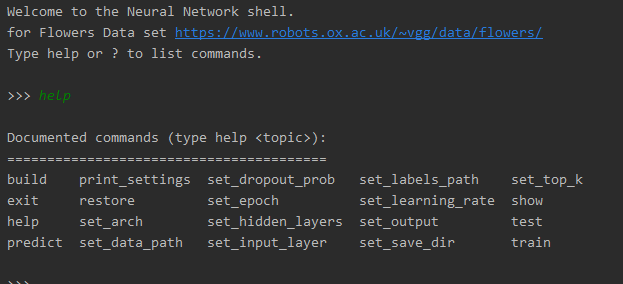
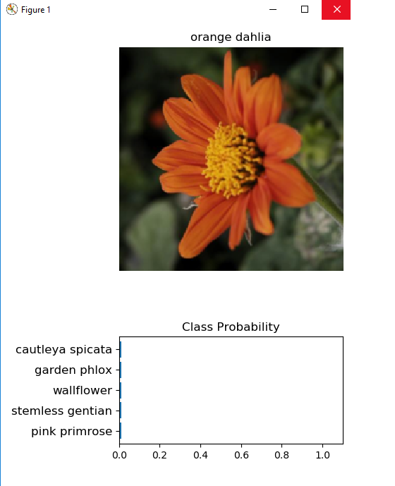

# AI application using pytroch
## Goal of this project
A Deep-learning classifier for flower data set https://www.robots.ox.ac.uk/~vgg/data/flowers/.
using transfer learning from pytorch pre trained models.

This project was focused on learning Neural Networks, Numpy, MatPlotLib and pytorch.

## Installation
- clone this  [repo](https://github.com/iplitharas/deep-learning-with-pytorch.git)
- create a new env and install the requirements.
>1. python3 -m pip install --upgrade pip
>2. pip3 install virtualenv
>3. create new env python3 -m venv
>4. pip3 install -r requirements.txt

## Usage
Run the main application app.py
Help shows all possible options

## Examples
### Prediction
>Predictions to the trained Neural Network can be done either
>with the path of the image of without it (it would load a random image
>from train_set)
> ### Without restore the state of the model

>### After restoring the state

### Train and test 
for default settings for training use print_settings
train and test  must always runner under cuda 

## License
The MIT License (MIT)

Copyright (c) 2015 Chris Kibble

Permission is hereby granted, free of charge, to any person obtaining a copy of this software and associated documentation files (the "Software"), to deal in the Software without restriction, including without limitation the rights to use, copy, modify, merge, publish, distribute, sublicense, and/or sell copies of the Software, and to permit persons to whom the Software is furnished to do so, subject to the following conditions:

The above copyright notice and this permission notice shall be included in all copies or substantial portions of the Software.

THE SOFTWARE IS PROVIDED "AS IS", WITHOUT WARRANTY OF ANY KIND, EXPRESS OR IMPLIED, INCLUDING BUT NOT LIMITED TO THE WARRANTIES OF MERCHANTABILITY, FITNESS FOR A PARTICULAR PURPOSE AND NONINFRINGEMENT. IN NO EVENT SHALL THE AUTHORS OR COPYRIGHT HOLDERS BE LIABLE FOR ANY CLAIM, DAMAGES OR OTHER LIABILITY, WHETHER IN AN ACTION OF CONTRACT, TORT OR OTHERWISE, ARISING FROM, OUT OF OR IN CONNECTION WITH THE SOFTWARE OR THE USE OR OTHER DEALINGS IN THE SOFTWARE.
